# Prática de Laboratório

## Objetivos

- Compreender o funcionamento de um analisador sintático descendente recursivo.
- Relacionar uma gramática livre de contexto aos procedimentos de um programa.
- Implementar procedimentos recursivos em C.
- Reconhecer expressões sintaticamente válidas e inválidas.
- Identificar e tratar erros sintáticos.

## Gramática da Prática

A gramática utilizada no analisador sintático é definida pelas seguintes produções:

1. `<expr> ::= <termo> + <expr> | <termo>`
2. `<termo> ::= <fator> * <termo> | <fator>`
3. `<fator> ::= <primário> ** <fator> | <primário>`
4. `<primário> ::= IDENT | NÚMERO | ( <expr> )`

## Roteiro da Atividade

O roteiro completo utilizado para o desenvolvimento da prática está disponível em:

[Roteiro — Analisador Sintático Descendente Recursivo](doc/Roteiro_Laboratorio_Analisador_Sintatico_Descendente_Recursivo.pdf)

## Resultados dos Testes

### Expressões Válidas

#### 1. IDENT

**Resultado:**

```text
Expressao Valida
```

**Print do terminal:**

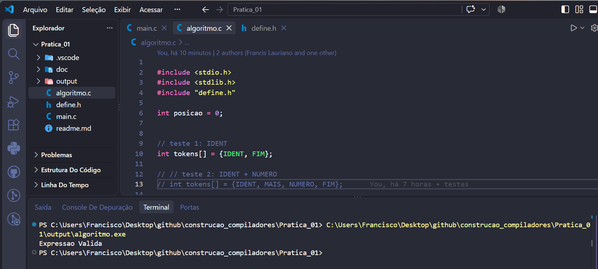

---

#### 2. IDENT + NUMERO

**Resultado:**

```text
Expressao Valida
```

**Print do terminal:**

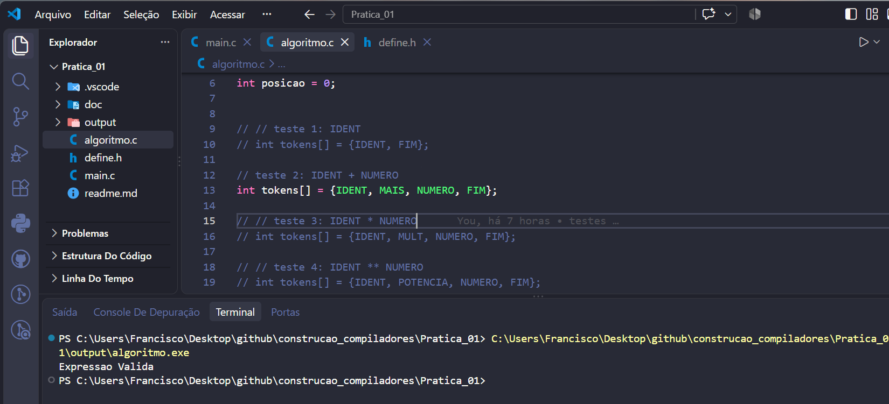

---

#### 3. IDENT * NUMERO

**Resultado:**

```text
Expressao Valida
```

**Print do terminal:**

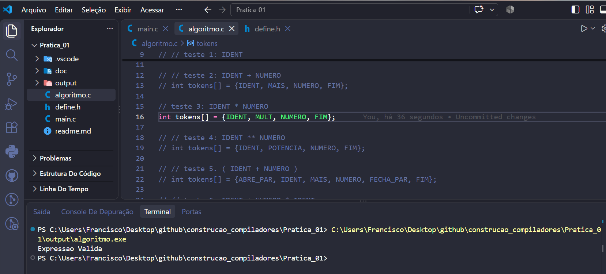

---

#### 4. IDENT ** NUMERO

**Resultado:**

```text
Expressao Valida
```

**Print do terminal:**

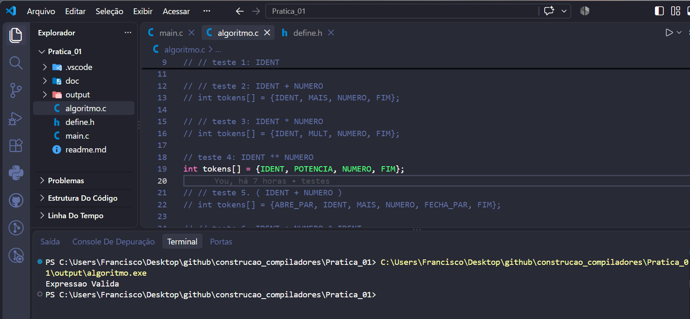

---

#### 5. ( IDENT + NUMERO )

**Resultado:**

```text
Expressao Valida
```

**Print do terminal:**

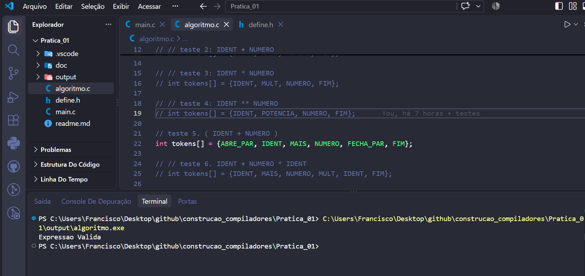

---

#### 6. IDENT + NUMERO * IDENT

**Resultado:**

```text
Expressao Valida
```

**Print do terminal:**

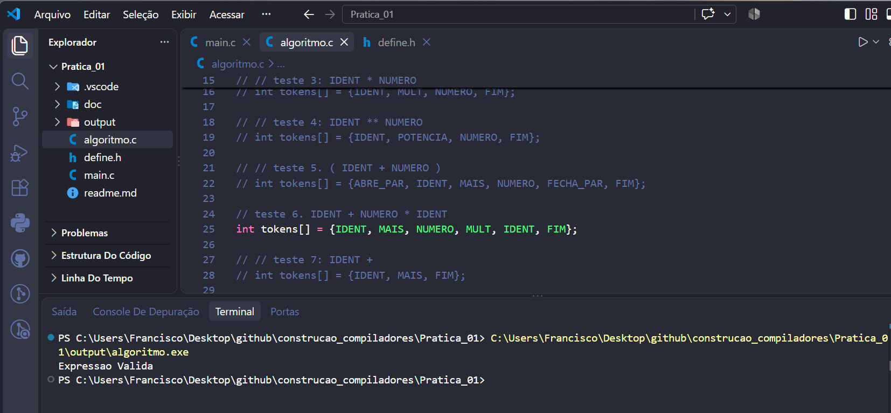

---

### Expressões Inválidas

#### 7. IDENT +

**Resultado:**

```text
Primario invalido
```

**Print do terminal:**

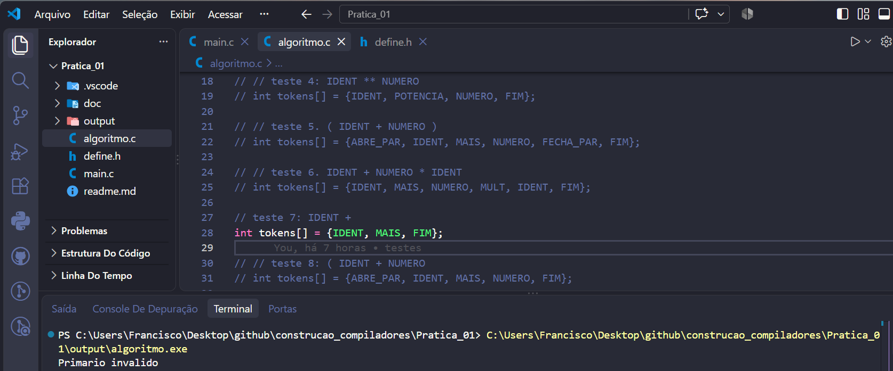

---

#### 8. ( IDENT + NUMERO

**Resultado:**

```text
Falta ')'
```

**Print do terminal:**

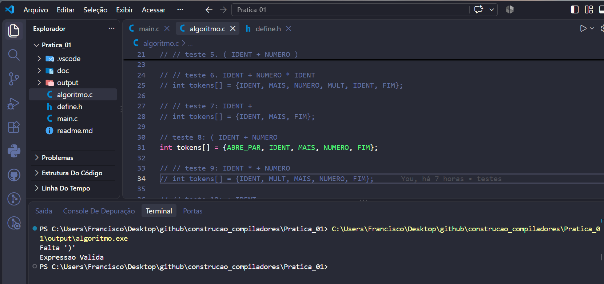

---

#### 9. IDENT * + NUMERO

**Resultado:**

```text
Primario invalido
```

**Print do terminal:**

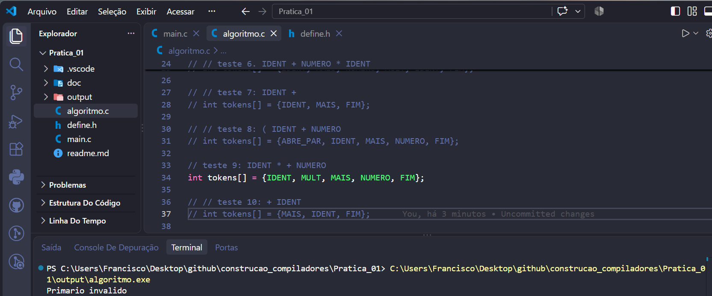

---

#### 10. + IDENT

**Resultado:**

```text
Primario invalido
```

**Print do terminal:**

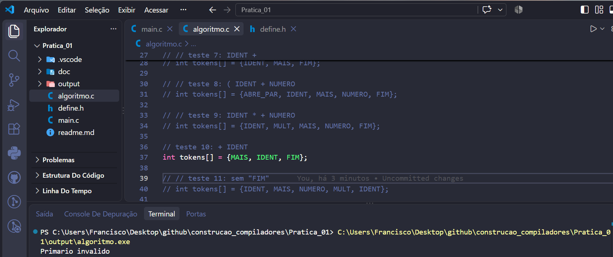

---

### Teste Adicional

#### 11. Sequência sem FIM

```text
IDENT, MAIS, NUMERO, MULT, IDENT
```

**Resultado:**

```text
Simbolo inesperado
```

**Print do terminal:**

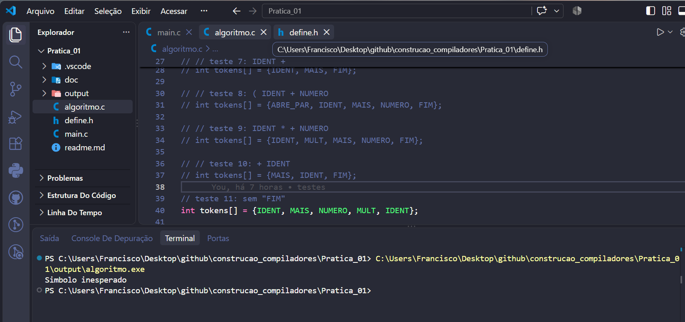