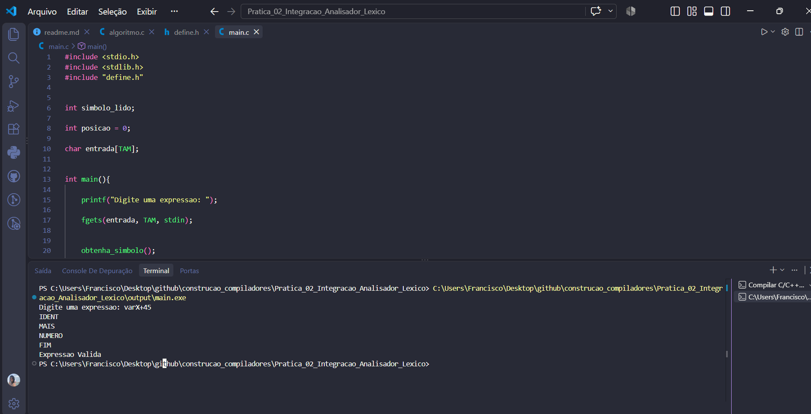
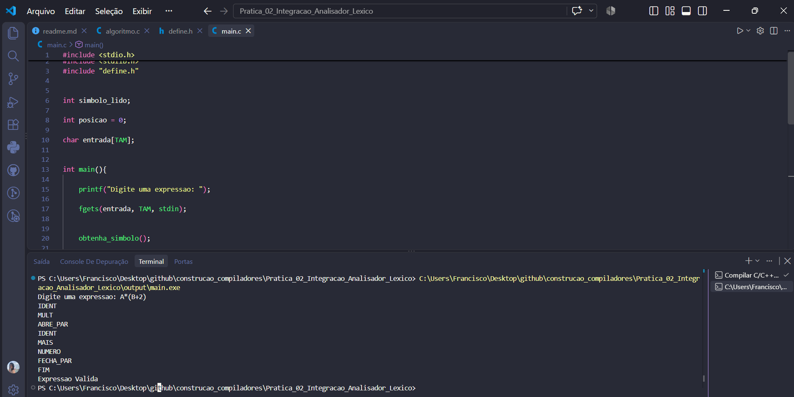
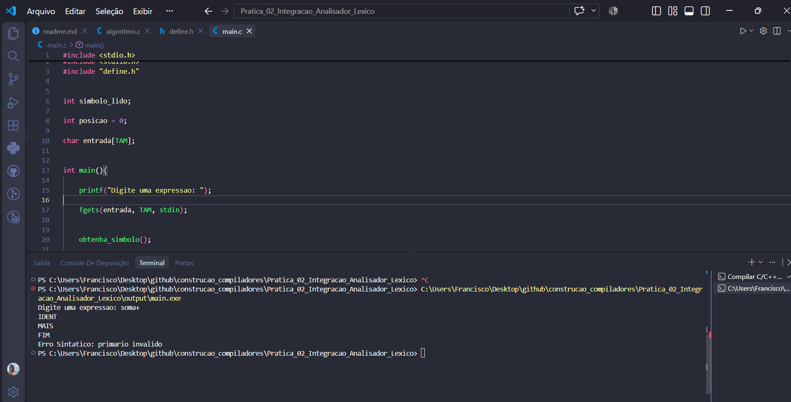
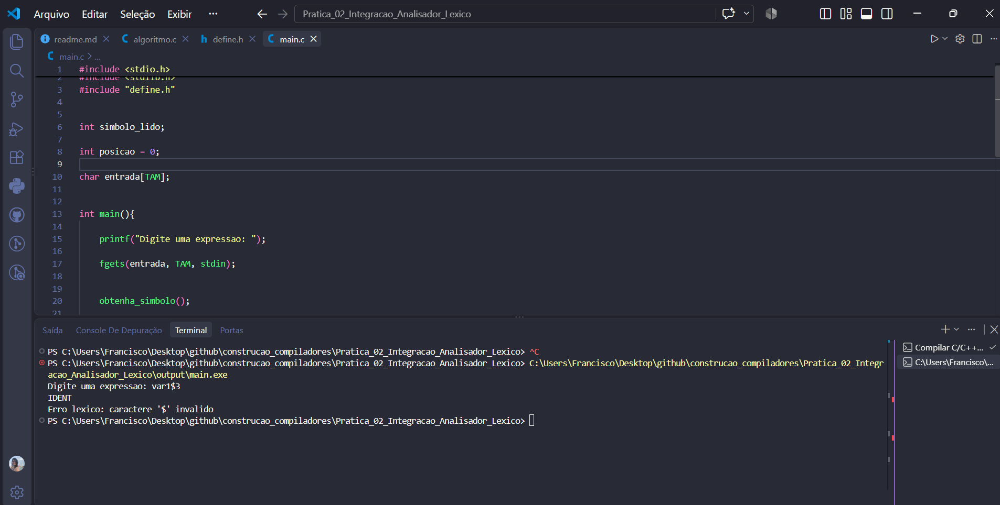

# Analisador Léxico-Sintático - Prática de Laboratório 02

## Objetivos

- Fazer o programa deixar de receber tokens definidos manualmente no código e passar a aceitar expressões em formato de texto.
- Implementar a varredura da string de entrada para identificar padrões e gerar os tokens correspondentes em tempo de execução.
- Construir um analisador léxico (Lexer/Scanner).
- Integrar o analisador léxico ao analisador sintático descendente recursivo desenvolvido na prática anterior.

---

## Contexto da Prática

Na Prática de Laboratório 01, a entrada do analisador sintático era representada por uma sequência de tokens inseridos manualmente no código.

Exemplo:

```c
int tokens[] = {
    IDENT,
    MAIS,
    NUMERO,
    FIM
};
```

Na Prática de Laboratório 02, o programa passa a receber uma expressão em formato de texto digitada pelo usuário.

Exemplo:

```text
varX + 45
```

O analisador léxico percorre a expressão e gera os tokens correspondentes:

```text
IDENT
MAIS
NUMERO
FIM
```

Esses tokens são utilizados pelo analisador sintático descendente recursivo para verificar se a expressão pertence à gramática.

O fluxo da análise passa a ser:

```text
Expressão em texto
        ↓
Analisador Léxico
        ↓
Tokens
        ↓
Analisador Sintático
        ↓
Expressão Válida ou Erro
```

---

## Gramática da Prática

A gramática utilizada pelo analisador sintático continua sendo definida pelas seguintes produções:

1. `<expr> ::= <termo> + <expr> | <termo>`
2. `<termo> ::= <fator> * <termo> | <fator>`
3. `<fator> ::= <primário> ** <fator> | <primário>`
4. `<primário> ::= IDENT | NUMERO | ( <expr> )`

---

## Tokens Reconhecidos

O analisador léxico reconhece os seguintes tokens:

| Token | Código | Representação |
|---|---:|---|
| `IDENT` | 1 | Identificador |
| `NUMERO` | 2 | Número |
| `MAIS` | 3 | `+` |
| `MULT` | 4 | `*` |
| `POTENCIA` | 5 | `**` |
| `ABRE_PAR` | 6 | `(` |
| `FECHA_PAR` | 7 | `)` |
| `FIM` | 8 | Final da entrada |

---

## Regras para os Tokens

### Identificadores

Os identificadores começam obrigatoriamente com uma letra e podem ser seguidos por letras ou números.

Exemplos:

```text
A
var1
somaTotal
```

São reconhecidos como:

```text
IDENT
```

### Números

Os números são formados exclusivamente por dígitos.

Exemplos:

```text
42
0
1024
```

São reconhecidos como:

```text
NUMERO
```

### Operadores

Os operadores reconhecidos são:

```text
+   → MAIS
*   → MULT
**  → POTENCIA
```

### Parênteses

Os parênteses são reconhecidos como:

```text
(   → ABRE_PAR
)   → FECHA_PAR
```

### Espaços em Branco

Espaços, tabulações e quebras de linha são ignorados pelo analisador léxico antes do reconhecimento do próximo token.

---

## Integração entre o Analisador Léxico e o Analisador Sintático

O analisador léxico percorre a string de entrada e retorna um token de cada vez.

A função:

```c
proximo_token()
```

é responsável por analisar os caracteres da entrada e retornar o próximo token reconhecido.

A função:

```c
obtenha_simbolo()
```

solicita o próximo token ao analisador léxico:

```c
void obtenha_simbolo(void){

    simbolo_lido = proximo_token();
}
```

O analisador sintático utiliza os tokens retornados pelo Lexer durante a execução das funções:

```text
expr()
termo()
fator()
primario()
```

O fluxo de execução ocorre da seguinte forma:

```text
main()
   ↓
obtenha_simbolo()
   ↓
proximo_token()
   ↓
expr()
   ↓
termo()
   ↓
fator()
   ↓
primario()
```

---

## Resultados dos Testes

### Expressões Válidas

#### 1. `varX + 45`

**Tokens gerados pelo Lexer:**

```text
IDENT
MAIS
NUMERO
FIM
```

**Resultado:**

```text
Expressao Valida
```

**Print do terminal:**



---

#### 2. `A * (B + 2)`

**Tokens gerados pelo Lexer:**

```text
IDENT
MULT
ABRE_PAR
IDENT
MAIS
NUMERO
FECHA_PAR
FIM
```

**Resultado:**

```text
Expressao Valida
```

**Print do terminal:**



---

### Expressões Inválidas

#### 3. `soma +`

**Tokens gerados pelo Lexer:**

```text
IDENT
MAIS
FIM
```

**Resultado:**

```text
Erro Sintatico: primario invalido
```

O analisador léxico reconhece os tokens da entrada, porém a expressão está sintaticamente incompleta após o operador `+`.

**Print do terminal:**



---

#### 4. `var1 $ 3`

**Token gerado antes do erro:**

```text
IDENT
```

Ao encontrar o caractere `$`, o analisador léxico interrompe a análise.

**Resultado:**

```text
Erro lexico: caractere '$' invalido
```

**Print do terminal:**



---

## Perguntas de Reflexão

### 1. O que acontece se o usuário digitar espaços extras no meio da expressão? Onde esse tratamento deve ocorrer?

Exemplo:

```text
A     +     B
```

Os espaços extras são ignorados pelo analisador léxico antes da identificação do próximo token.

Na implementação, esse tratamento ocorre através de:

```c
while(isspace(entrada[posicao])){
    posicao += 1;
}
```

Dessa forma, as expressões:

```text
A+B
```

e:

```text
A     +     B
```

geram a mesma sequência de tokens:

```text
IDENT
MAIS
IDENT
FIM
```

Portanto, o tratamento dos espaços ocorre na fase léxica.

---

### 2. Como o Lexer diferencia o operador `*` (MULT) do operador `**` (POTENCIA) sem causar ambiguidade? O que é lookahead?

Quando o analisador léxico encontra o caractere `*`, ele verifica o próximo caractere da entrada.

Se o próximo caractere também for `*`, o token reconhecido será:

```text
POTENCIA
```

Caso contrário, será:

```text
MULT
```

Exemplo:

```text
*   → MULT
**  → POTENCIA
```

Essa verificação do próximo caractere antes de decidir qual token será gerado é chamada de **lookahead**, que significa "olhar adiante".

---

### 3. Se uma variável contiver um caractere inválido, qual fase será responsável por interromper a execução e gerar a mensagem de erro?

Exemplo:

```text
v@lor
```

A fase responsável é a análise léxica.

O Lexer é responsável por percorrer os caracteres da entrada e verificar se eles correspondem aos padrões reconhecidos.

Como o caractere `@` não corresponde a nenhum token válido, o analisador léxico interrompe a execução e informa um erro.

Exemplo:

```text
Erro lexico: caractere '@' invalido
```

Portanto, esse erro é identificado na fase léxica antes que o caractere inválido seja enviado ao analisador sintático.

---

## Roteiro Completo da Atividade

O roteiro completo utilizado para o desenvolvimento da prática está disponível em:

[Roteiro — Integração do Analisador Léxico ao Analisador Sintático Descendente Recursivo](doc/Pratica_2_Integracao_Lexico_Sintatica.pdf)